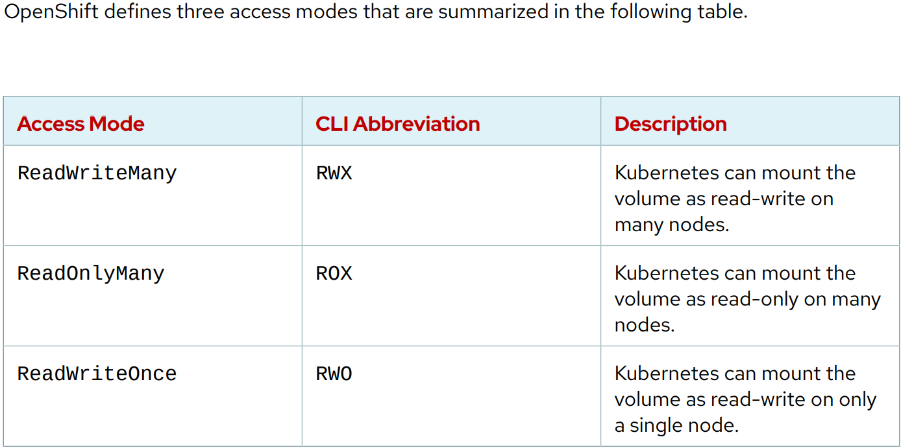

# Verifying the Health of a Cluster

**Two main ways of maintaining persistent storage:**
- Volumes (preferred)
- Bind mounts

**Two ways of provisioning storage:**
- Static (requires cluster admin to create persistent volume manually)
- Dynamic (uses storage classes to create persistent volumes on demand)

*Note: When a persistent volume binds to a persistent volume claim, the persistent volume cannot be bound to another persistent volume claim.*

View available storage classes: `oc get storageclass`

